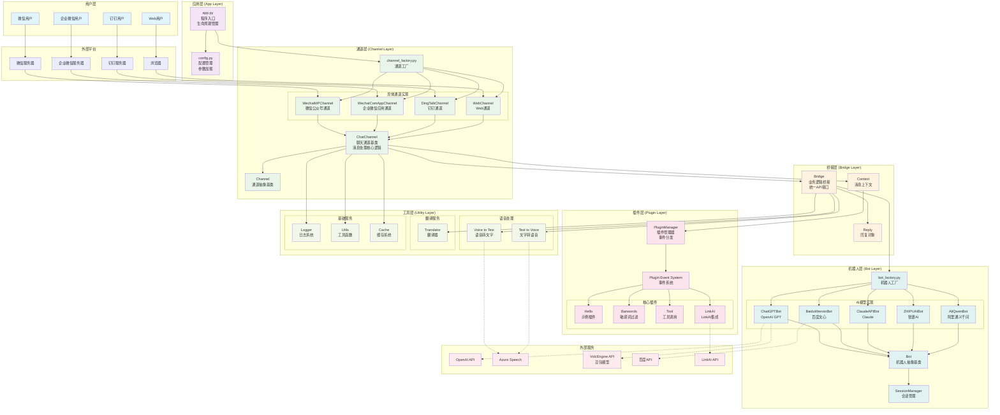
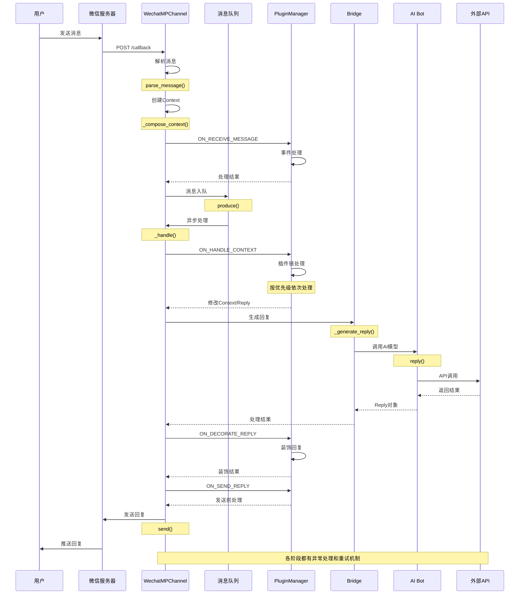
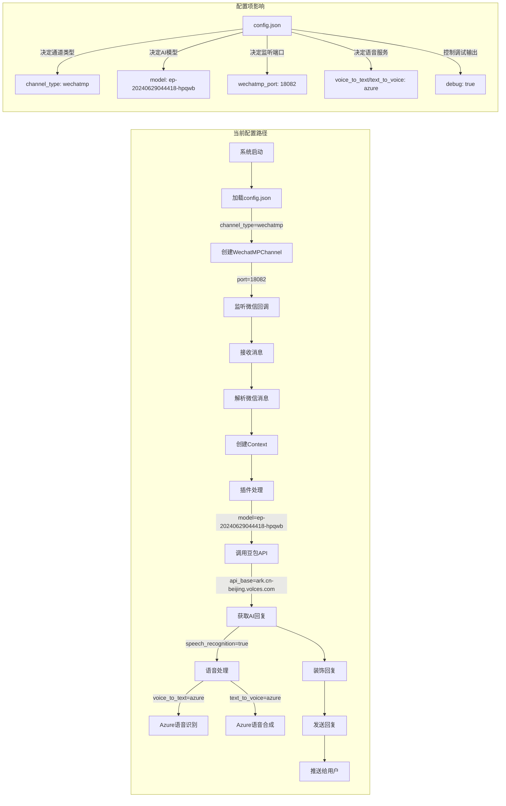
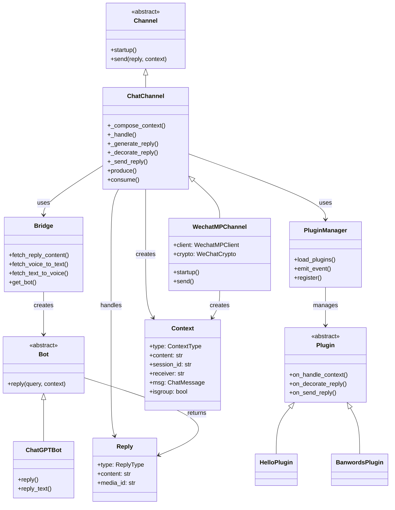
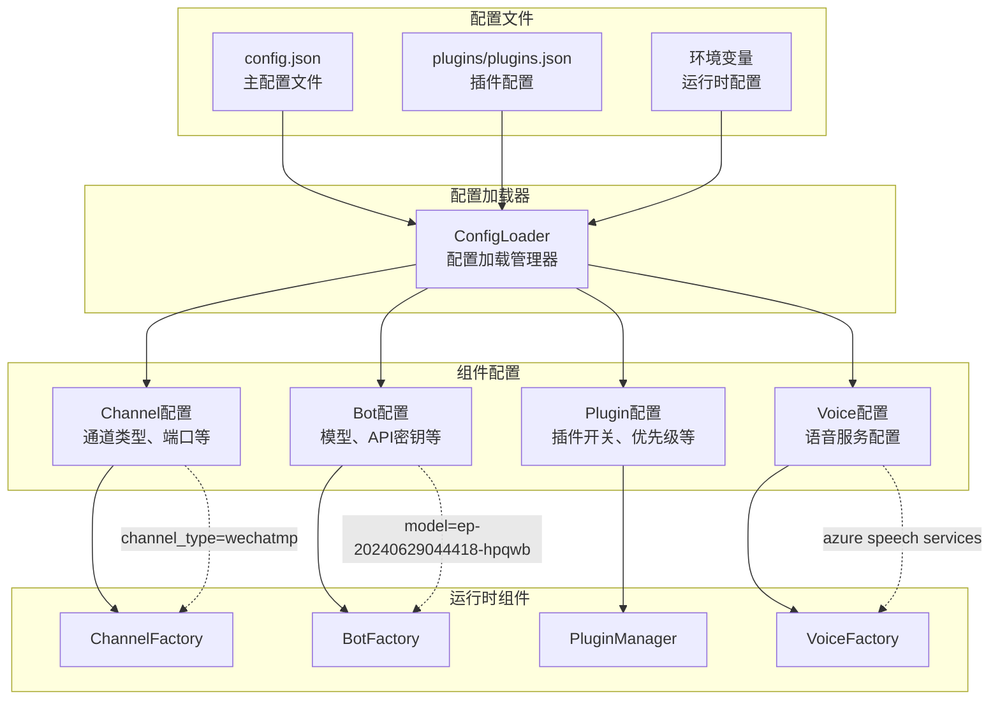

# ChatGPT-on-WeChat 技术架构图

## 系统架构图



## 消息处理流程图



## 当前配置下的执行路径



## 核心组件关系图



## 数据流转图

```mermaid
flowchart TD
    subgraph "输入数据"
        INPUT[用户输入<br/>文本/语音/图片]
    end

    subgraph "数据解析"
        PARSE[消息解析<br/>parse_message()]
        MSG[WeChatMPMessage<br/>消息对象]
    end

    subgraph "上下文创建"
        CONTEXT[Context对象<br/>{type, content, session_id, ...}]
    end

    subgraph "插件处理"
        PLUGIN_IN[插件输入处理]
        PLUGIN_OUT[插件输出处理]
    end

    subgraph "AI处理"
        AI_INPUT[AI输入格式化]
        AI_CALL[AI API调用]
        AI_OUTPUT[AI输出解析]
    end

    subgraph "回复生成"
        REPLY[Reply对象<br/>{type, content, media_id}]
    end

    subgraph "输出处理"
        FORMAT[格式化输出]
        SEND[发送处理]
        OUTPUT[用户接收<br/>文本/语音/图片]
    end

    INPUT --> PARSE
    PARSE --> MSG
    MSG --> CONTEXT
    CONTEXT --> PLUGIN_IN
    PLUGIN_IN --> AI_INPUT
    AI_INPUT --> AI_CALL
    AI_CALL --> AI_OUTPUT
    AI_OUTPUT --> REPLY
    REPLY --> PLUGIN_OUT
    PLUGIN_OUT --> FORMAT
    FORMAT --> SEND
    SEND --> OUTPUT

    %% 数据转换标注
    PARSE -.->|JSON解析| MSG
    MSG -.->|属性映射| CONTEXT
    CONTEXT -.->|参数提取| AI_INPUT
    AI_OUTPUT -.->|结果封装| REPLY
    REPLY -.->|类型转换| FORMAT
```

## 配置驱动架构



此技术架构图清晰地展示了系统的各个层次和组件之间的关系，以及基于当前配置文件的具体执行路径。通过这些图表，可以更好地理解系统的整体设计和运行机制。
