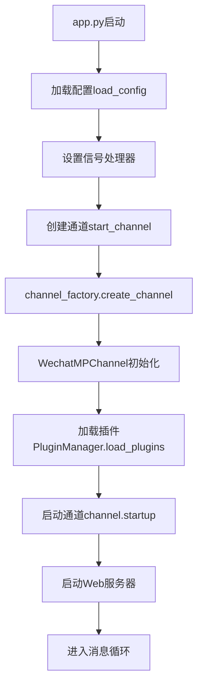
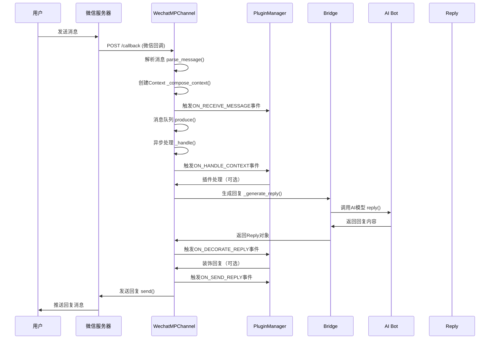
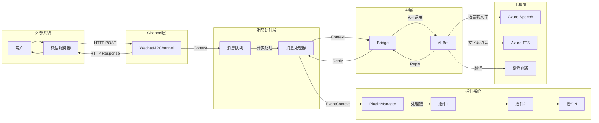

# ChatGPT-on-WeChat 系统设计文档

## 1. 系统概述

### 1.1 项目简介
ChatGPT-on-WeChat 是一个基于Python的智能聊天机器人系统，支持多种消息平台（微信公众号、企业微信、钉钉、飞书等）和多种AI模型（ChatGPT、Claude、文心一言、智谱AI等）。系统采用插件化架构，具有高度的可扩展性和灵活性。

### 1.2 系统架构
系统采用分层架构设计，主要包括：
- **应用层（App Layer）**: 程序入口，负责系统启动和生命周期管理
- **通道层（Channel Layer）**: 消息接收和发送的抽象层，支持多种平台
- **桥接层（Bridge Layer）**: 统一的业务逻辑处理层，连接通道和机器人
- **机器人层（Bot Layer）**: 各种AI模型的实现层
- **插件层（Plugin Layer）**: 功能扩展层，支持动态加载
- **工具层（Utility Layer）**: 基础服务层，包括日志、配置、工具等

## 2. 当前配置分析

### 2.1 配置文件解析
根据 `config.json` 配置，当前系统配置如下：

```json
{
  "channel_type": "wechatmp",           // 使用微信公众号通道
  "model": "ep-20240629044418-hpqwb",   // 使用豆包模型
  "open_ai_api_base": "https://ark.cn-beijing.volces.com/api/v3",
  "wechatmp_port": 18082,              // 微信公众号监听端口
  "debug": true,                       // 开启调试模式
  "speech_recognition": true,          // 开启语音识别
  "voice_to_text": "azure",           // 使用Azure语音转文字
  "text_to_voice": "azure"            // 使用Azure文字转语音
}
```

### 2.2 系统运行模式
- **通道类型**: 微信公众号（WeChatMP）
- **AI模型**: 豆包（VolcEngine）
- **语音处理**: Azure Cognitive Services
- **插件系统**: 已启用，支持动态扩展

## 3. 程序执行全流程

### 3.1 系统启动流程



#### 3.1.1 启动详细步骤

1. **程序入口** (`app.py:run()`)
   - 加载配置文件 `config.json`
   - 设置信号处理器（SIGINT、SIGTERM）
   - 根据配置确定通道类型（默认：wechatmp）

2. **通道创建** (`channel_factory.create_channel()`)
   - 根据 `channel_type` 创建对应通道实例
   - 当前配置创建 `WechatMPChannel` 实例

3. **插件加载** (`PluginManager.load_plugins()`)
   - 扫描 `plugins/` 目录
   - 按优先级加载插件
   - 注册事件监听器

4. **通道启动** (`WechatMPChannel.startup()`)
   - 启动Web服务器监听端口18082
   - 配置微信公众号回调URL
   - 初始化微信客户端

### 3.2 消息处理流程



#### 3.2.1 消息接收阶段

1. **微信回调处理** (`passive_reply.py:Query.POST()`)
   ```python
   # 接收微信服务器POST请求
   message = web.data()
   msg = parse_message(message)
   wechatmp_msg = WeChatMPMessage(msg, client=channel.client)
   ```

2. **消息解析与Context创建**
   ```python
   # 创建消息上下文
   context = channel._compose_context(
       wechatmp_msg.ctype,
       content,
       isgroup=False,
       msg=wechatmp_msg
   )
   ```

3. **触发接收事件**
   ```python
   e_context = PluginManager().emit_event(
       EventContext(Event.ON_RECEIVE_MESSAGE, {
           "channel": self,
           "context": context
       })
   )
   ```

#### 3.2.2 消息处理阶段

1. **消息入队** (`ChatChannel.produce()`)
   ```python
   # 将消息放入处理队列
   self.handler_pool.submit(self._handle, context)
   ```

2. **触发处理事件** (`ChatChannel._generate_reply()`)
   ```python
   e_context = PluginManager().emit_event(
       EventContext(Event.ON_HANDLE_CONTEXT, {
           "channel": self,
           "context": context,
           "reply": reply
       })
   )
   ```

3. **插件处理链**
   - 按优先级依次调用插件的 `on_handle_context()` 方法
   - 插件可以修改Context、生成Reply或控制流程
   - 支持三种动作：CONTINUE、BREAK、BREAK_PASS

4. **AI模型调用** (`Bridge.fetch_reply_content()`)
   ```python
   # 根据配置路由到对应的Bot
   bot = self.get_bot("chat")
   reply = bot.reply(query, context)
   ```

#### 3.2.3 回复处理阶段

1. **回复装饰** (`ChatChannel._decorate_reply()`)
   ```python
   e_context = PluginManager().emit_event(
       EventContext(Event.ON_DECORATE_REPLY, {
           "channel": self,
           "context": context,
           "reply": reply
       })
   )
   ```

2. **回复发送** (`ChatChannel._send_reply()`)
   ```python
   e_context = PluginManager().emit_event(
       EventContext(Event.ON_SEND_REPLY, {
           "channel": self,
           "context": context,
           "reply": reply
       })
   )
   ```

3. **消息推送** (`WechatMPChannel.send()`)
   - 根据Reply类型选择发送方式
   - 处理文本、语音、图片等不同类型消息
   - 通过微信公众号API发送回复

### 3.3 关键组件详解

#### 3.3.1 Channel层架构

```python
Channel (抽象基类)
├── ChatChannel (聊天通道基类)
    ├── WechatMPChannel (微信公众号)
    ├── WechatComAppChannel (企业微信应用)
    ├── DingTalkChannel (钉钉)
    ├── FeiShuChannel (飞书)
    └── WebChannel (Web界面)
```

**WechatMPChannel特点**：
- 支持被动回复和主动推送
- 处理微信加密/解密
- 支持多媒体消息类型
- 内置消息去重和防重复处理

#### 3.3.2 Bridge层设计

Bridge作为中介者模式的实现，统一管理：
- **Bot路由**: 根据配置选择AI模型
- **语音处理**: 统一的语音转文字/文字转语音接口
- **翻译服务**: 多语言翻译支持
- **类型转换**: 统一的请求/响应格式

```python
class Bridge:
    def fetch_reply_content(self, query, context):
        return self.get_bot("chat").reply(query, context)

    def fetch_voice_to_text(self, voiceFile):
        return self.get_bot("voice_to_text").voiceToText(voiceFile)
```

#### 3.3.3 Bot层架构

```python
Bot (抽象基类)
├── ChatGPTBot (OpenAI官方API)
├── BaiduWenxinBot (百度文心)
├── ZHIPUAIBot (智谱AI)
├── ClaudeAPIBot (Claude)
├── AliQwenBot (阿里通义千问)
└── LinkAIBot (LinkAI服务)
```

**当前使用的Bot**：
- 模型：豆包（ep-20240629044418-hpqwb）
- API Base：https://ark.cn-beijing.volces.com/api/v3
- 实现类：推测为ChatGPTBot兼容接口

#### 3.3.4 Plugin系统架构

```python
PluginManager (单例)
├── 插件注册与发现
├── 事件分发机制
├── 优先级管理
└── 生命周期管理

Plugin事件类型:
├── ON_RECEIVE_MESSAGE (消息接收)
├── ON_HANDLE_CONTEXT (消息处理)
├── ON_DECORATE_REPLY (回复装饰)
└── ON_SEND_REPLY (回复发送)
```

**关键插件**：
- **Hello**: 示例插件，处理简单问候
- **Banwords**: 敏感词过滤
- **Tool**: 工具调用支持
- **LinkAI**: LinkAI平台集成
- **BDunit**: 百度UNIT对话系统

## 4. 数据流图

### 4.1 完整数据流



### 4.2 Context对象结构

```python
Context = {
    "type": ContextType,          # TEXT, VOICE, IMAGE, IMAGE_CREATE等
    "content": str,               # 消息内容
    "session_id": str,            # 会话ID
    "receiver": str,              # 接收者ID
    "msg": ChatMessage,           # 原始消息对象
    "isgroup": bool,              # 是否群聊
    "channel": Channel,           # 通道实例
    "desire_rtype": ReplyType     # 期望回复类型
}
```

### 4.3 Reply对象结构

```python
Reply = {
    "type": ReplyType,           # TEXT, VOICE, IMAGE, ERROR, INFO等
    "content": str/bytes,        # 回复内容
    "media_id": str             # 媒体文件ID（可选）
}
```

## 5. 配置驱动的执行流程

### 5.1 基于当前配置的执行路径

1. **启动阶段**
   ```
   app.py → load_config() → channel_type="wechatmp"
   → WechatMPChannel → 监听端口18082
   ```

2. **消息接收**
   ```
   微信服务器 → POST http://域名:18082/callback
   → WechatMPChannel.passive_reply → 解析消息
   ```

3. **AI处理**
   ```
   Context → Bridge → model="ep-20240629044418-hpqwb"
   → VolcEngine API → 生成回复
   ```

4. **语音处理**（如果有语音消息）
   ```
   语音文件 → Azure Speech-to-Text → 文本 → AI处理
   → 文本回复 → Azure Text-to-Speech → 语音回复
   ```

### 5.2 关键配置项影响

| 配置项 | 影响组件 | 当前值 | 说明 |
|--------|----------|--------|------|
| channel_type | Channel Factory | wechatmp | 决定使用微信公众号通道 |
| model | Bridge/Bot Factory | ep-20240629044418-hpqwb | 使用豆包模型 |
| wechatmp_port | WechatMPChannel | 18082 | 微信回调监听端口 |
| voice_to_text | Bridge | azure | 语音识别服务 |
| text_to_voice | Bridge | azure | 语音合成服务 |
| debug | 全局 | true | 开启详细日志 |

## 6. 异常处理机制

### 6.1 错误处理层级

1. **应用级异常**
   - 信号处理：优雅关闭
   - 配置错误：启动失败保护
   - 网络异常：重试机制

2. **通道级异常**
   - 消息解析错误：返回错误状态
   - 认证失败：记录日志并丢弃
   - 超时处理：异步超时回复

3. **处理级异常**
   - 插件异常：跳过该插件继续处理
   - AI调用失败：返回错误回复
   - 队列满载：消息丢弃策略

### 6.2 重试与恢复

```python
# 消息发送重试
def _send(self, reply: Reply, context: Context, retry_cnt=0):
    try:
        self.send(reply, context)
    except Exception as e:
        if retry_cnt < 2:
            time.sleep(3 + 3 * retry_cnt)
            self._send(reply, context, retry_cnt + 1)
```

## 7. 性能优化

### 7.1 并发处理

- **消息队列**: 异步处理避免阻塞
- **线程池**: 控制并发数量
- **会话管理**: 同一会话串行处理，不同会话并行

### 7.2 缓存机制

- **媒体文件**: 临时文件自动清理
- **会话状态**: 内存中维护对话历史
- **插件配置**: 启动时加载，运行时缓存

### 7.3 资源管理

```python
# 会话并发控制
sessions = {}  # 会话状态管理
lock = threading.Lock()  # 线程安全
futures = {}  # Future对象管理
```

## 8. 扩展点

### 8.1 新增Channel

1. 继承 `ChatChannel` 基类
2. 实现 `startup()` 和 `send()` 方法
3. 在 `channel_factory.py` 中注册

### 8.2 新增Bot

1. 继承 `Bot` 基类
2. 实现 `reply()` 方法
3. 在 `bot_factory.py` 中注册

### 8.3 新增Plugin

1. 继承 `Plugin` 基类
2. 使用 `@plugins.register` 装饰器
3. 实现事件处理方法

## 9. 部署与监控

### 9.1 部署配置

- **Web服务**: 端口18082对外暴露
- **回调URL**: 微信公众号后台配置
- **SSL证书**: HTTPS支持（可选）
- **反向代理**: Nginx/Apache配置

### 9.2 日志监控

- **应用日志**: `common/log.py` 统一管理
- **错误追踪**: 异常堆栈记录
- **性能指标**: 响应时间、吞吐量
- **业务监控**: 消息处理成功率

## 10. 总结

该系统通过分层架构和插件化设计，实现了高度的模块化和可扩展性。当前配置下，系统以微信公众号为主要通道，使用豆包AI模型提供智能对话服务，并集成了Azure语音服务。整个消息处理流程清晰，从接收、处理到回复都有完善的异常处理和重试机制，确保系统的稳定性和可靠性。

关键设计优势：
- **可扩展性**: 插件系统支持功能动态扩展
- **可配置性**: 配置驱动的架构便于部署和维护
- **可靠性**: 多层次的异常处理和重试机制
- **性能**: 异步处理和并发控制保证响应速度
- **灵活性**: 支持多种消息平台和AI模型
